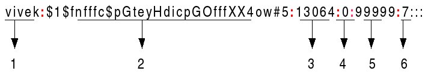

# Configuration Files 
## passwd file
> passwd 文件保存用戶名、用戶登入是否需要進行密碼驗證、uid、gid、用戶終端的編譯器

> passwd location:**/etc/passwd** 

```bash
UserName:EncryptedPassword:UID:GID:FullNameOfTheUser:UserHomeDirectory

example:
invscout:*:200:1::/var/adm/invscout:/usr/bin/ksh
```

可以在 `passwd` 文件中進行配置，如果新增用戶可以識別，但是**不會新增用戶Home目錄** 。


## shadow file
> shadow 文件保存用戶名和密碼

主要是兩個字段一個是用戶名稱另一個是加密密碼字段

加密密碼字段主要由是 `$6 + 加密後的密碼`, 其中`$6`是加密方式。
 
1. UserName
2. Password	
	1. `$1$` is MD5
	2. `$2a$` is Blowfish
	3. `$2y$` is Blowfish
	4. `$5$` is SHA-256
	5. `$6$` is SHA-512
	6. `$y$` is yescrypt
3. Last Password change
4. Minimum
5. Maximum
6. Warn: The number of days before Password is to expire that user is warned that his/her password must be changed.
7. Inactive
8. Expire


